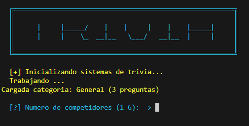

# Trivia TUI App

## Descripción
Juego de trivia en C++ para terminal con preguntas por archivo, perfiles/historial y separación en headers.

## Objetivo
Practicar C++ modular, manejo de archivos y experiencia TUI.

## Tecnologías utilizadas
- C++
- Consola
- Archivos .txt
- Programación modular

## Funcionalidades principales
- Juego de trivia
- Banco General.txt
- Historial/perfiles
- Headers de modelos/juego/archivos
- Ejecutables incluidos

## Mi rol
Implementé flujo de juego, estructuras, carga de preguntas y persistencia.

## Aprendizajes clave
- Headers
- Archivos C++
- Estructuras de juego
- Validación

## Instalación y ejecución
```bash
cd Trivia-TUIApp/programa
g++ main.cpp -o trivia.exe
./trivia.exe
```

## Estructura del proyecto
- main.cpp: entrada
- *.h: módulos
- General.txt: preguntas
- history/profiles: datos

## Capturas o demo


## Estado del proyecto
Proyecto académico funcional.

## Valor técnico demostrado
Demuestra fundamentos de C++, modularidad y persistencia simple.

## Mejoras futuras
- Separar .cpp
- Agregar Makefile
- Documentar preguntas

## Autor
Geovanni González  
Estudiante de Ingeniería en Computación  
GitHub: [Geovanni-Gonzalez](https://github.com/Geovanni-Gonzalez)


